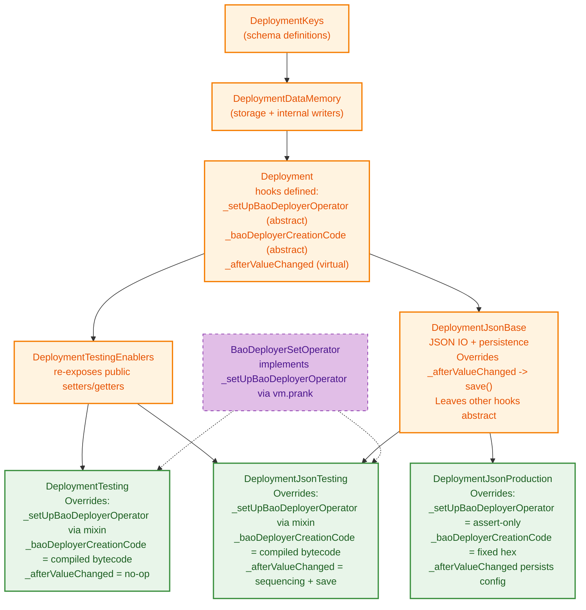
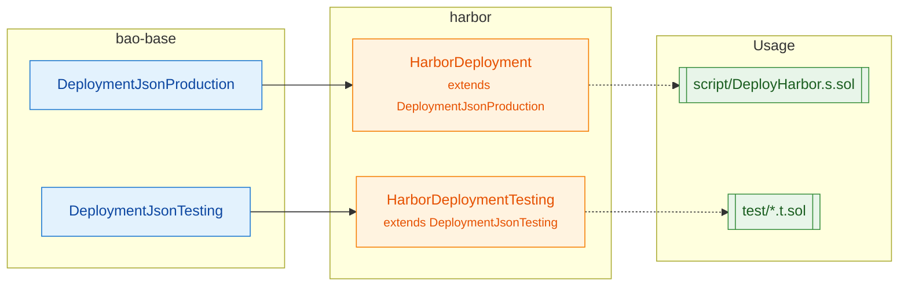

# Deployment Architecture Overview

This document describes the bao-base deployment framework architecture, showing the inheritance hierarchy and how downstream projects (like Harbor) extend it.

## Use Cases

There are three deployment class chains, each for a specific use case. The base classes are abstract; downstream concrete classes provide environment-specific behavior.

| Use Case                | Base Class                            | Concrete Example             | Storage   | Public Setters     | BaoDeployer Path                                  |
| ----------------------- | ------------------------------------- | ---------------------------- | --------- | ------------------ | ------------------------------------------------- |
| **Production**          | `DeploymentJsonBase`                  | `DeploymentJsonProduction`\* | JSON file | No (config-driven) | Fixed hex bytecode + multisig-configured operator |
| **Testing with JSON**   | `DeploymentJsonBase`                  | `DeploymentJsonTesting`      | JSON file | Yes                | Compiled bytecode + vm.prank operator (mixin)     |
| **Testing memory-only** | `DeploymentDataMemory` → `Deployment` | `DeploymentTesting`          | In-memory | Yes                | Compiled bytecode + vm.prank operator (mixin)     |

\*Downstream projects (e.g. Harbor) inherit from `DeploymentJsonProduction` to inject protocol-specific keys while keeping production guardrails.

### Production vs Testing: BaoDeployer Differences

**BaoDeployer Bytecode (`_baoDeployerCreationCode()` hook):**

- **Testing implementations** return `type(BaoDeployer).creationCode`
- **Production implementation** returns a fixed hex literal that never changes unless the audited artifact changes

**BaoDeployer Operator (`_setUpBaoDeployerOperator()` hook):**

- **Testing implementations** call the `BaoDeployerSetOperator` mixin which uses vm.prank to set `address(this)` as operator
- **Production implementation** simply asserts the operator is already configured by the multisig (no prank, no writes)

### Production (`DeploymentJsonBase` + `DeploymentJsonProduction`)

- `DeploymentJsonBase` handles persistence (file paths, serialization) and inherits storage from `Deployment`
- `DeploymentJsonProduction` is the smallest concrete class that:
  - verifies BaoDeployer operator via `_setUpBaoDeployerOperator()` (no vm.prank, only assertions)
  - overrides `_baoDeployerCreationCode()` to return the audited hex literal
- All production field changes must come from the initial JSON config loaded in `start()`; there is no public setter surface on this path.
- Downstream projects extend `DeploymentJsonProduction` to add domain-specific keys and workflows

### Testing with JSON (`DeploymentJsonTesting` - concrete)

- Public setters for test setup (inherited from `DeploymentDataMemory`)
- Sequencing support for capturing deployment phases
- Uses `BaoDeployerSetOperator` mixin for vm.prank setup

### Testing memory-only (`DeploymentTesting` - concrete)

- Fast, no file I/O
- Public setters for test setup (inherited from `DeploymentDataMemory`)
- Uses `BaoDeployerSetOperator` mixin for vm.prank setup

## Design Principles

1. **Linear core inheritance** - The main chain is strictly linear to avoid diamond inheritance issues
2. **Single override per virtual** - Each virtual function is overridden on exactly one path to any concrete class
3. **Visibility control via inheritance** - `DeploymentJsonBase` makes setters call the persistence hook; testing variants inherit the external surface

Solidity’s C3 linearization lets us stack multiple bases as long as every override order stays consistent. The requirement here is not “perfectly linear inheritance” but “no conflicting overrides of the same virtual function on any path,” so we focus on avoiding true diamond override patterns rather than banning multiple inheritance entirely.

### Public Setter Surface

- `DeploymentDataMemory.sol` owns storage and the internal `_write*` helpers.
- `DeploymentTestingEnablers.sol` extends `Deployment` and re-exposes the `external` getters/setters while still calling `_afterValueChanged()` so persistence hooks run.
- **Production path:** `DeploymentJsonProduction` and downstream prod harnesses inherit `Deployment` directly, skipping `DeploymentTestingEnablers`, so they have no publicly callable setters. All field changes come from the JSON config at `start()` or high-level functions like `deployProxy()` that use the internal writers.
- **Testing paths:** `DeploymentTesting` and `DeploymentJsonTesting` inherit `DeploymentTestingEnablers`, so fuzzing and fixtures keep the public surface (plus sequencing/operator mixins).
- Read-only views (`get*`) remain universally accessible through `Deployment`’s interface so scripts can inspect deployment state without mutability.



## Virtual Function Override Paths

Each virtual function has exactly one override on the path to each concrete class:

### From `Deployment` (abstract functions)

| Function                        | Purpose                     | DeploymentJsonBase | DeploymentTesting | DeploymentJsonProduction | DeploymentJsonTesting |
| ------------------------------- | --------------------------- | ------------------ | ----------------- | ------------------------ | --------------------- |
| `_setUpBaoDeployerOperator()`\* | Configure/verify operator   | **abstract hook**  | vm.prank mixin    | assert-only (no writes)  | vm.prank mixin        |
| `_baoDeployerCreationCode()`\*  | Return BaoDeployer bytecode | **abstract hook**  | compiled bytecode | fixed hex literal        | compiled bytecode     |
| `_afterValueChanged(key)`       | Hook after value write      | save()             | no-op             | inherited                | sequencing + super    |

\*Implementations call these hooks from within `Deployment` lifecycle methods; having both hooks ensures production/test parity without diamonds.

### From `Deployment` (virtual functions with default impl)

| Function | Default | DeploymentJsonBase | DeploymentTesting | DeploymentJsonProduction | DeploymentJsonTesting |
| `start()` | Set session state | Load JSON first, then super | _inherited_ | _inherited_ | _inherited_ |
| `finish()` | Transfer ownership | _inherited_ | _inherited_ | _inherited_ | _inherited_ |
| `_deriveSystemSalt()` | Return system salt | _inherited_ | _inherited_ | _inherited_ | _inherited_ |

### From `DeploymentDataMemory` (virtual external, implements interface)

| Function                 | Visibility | DeploymentJsonBase  | DeploymentTesting | DeploymentJsonProduction | DeploymentJsonTesting |
| ------------------------ | ---------- | ------------------- | ----------------- | ------------------------ | --------------------- |
| `get(key)`               | external   | _inherited_         | _inherited_       | _inherited_              | _inherited_           |
| `getAddress(key)`        | external   | _inherited_         | _inherited_       | _inherited_              | _inherited_           |
| `setAddress(key, value)` | external   | override: adds hook | _inherited_       | inherited                | inherited             |
| _(all other setters)_    | external   | override: adds hook | _inherited_       | inherited                | inherited             |

### From `DeploymentJsonBase` (virtual functions)

| Function               | Default     | DeploymentJsonProduction | DeploymentJsonTesting   |
| ---------------------- | ----------- | ------------------------ | ----------------------- |
| `_getPrefix()`         | "." (cwd)   | inherited                | "results" or env var    |
| `_getFilename()`       | `_filename` | inherited                | Override for sequencing |
| `_afterValueChanged()` | save()      | inherited                | sequencing + super      |

## No Diamond Inheritance

With this design, there are no diamonds. The mixin is used only for the abstract function implementation:

```
DeploymentKeys → DeploymentDataMemory → Deployment
                        │                │
                        │                ├─────────→ DeploymentJsonBase (abstract)
                        │                                      │
                        │                                      ├→ DeploymentJsonProduction (concrete)
                        │                                      └→ DeploymentJsonTesting (concrete)
                        │                                                         ▲
                        │                                                         ║ (BaoDeployerSetOperator mixin)
                        └────────────→ DeploymentTesting (concrete) ───────────────┘
```

Only testing classes consume the vm.prank mixin; production stays on the linear chain with no additional inheritance edges.

## File Layout

```
script/deployment/
├── DeploymentKeys.sol               # Schema definitions (abstract)
├── DeploymentDataMemory.sol         # Storage layer + internal writers (abstract)
├── DeploymentTestingEnablers.sol    # Public setter & testing helpers (inherits Deployment)
├── Deployment.sol                   # Core operations + hooks (abstract)
├── DeploymentJsonBase.sol           # JSON persistence base (abstract)
├── DeploymentJsonProduction.sol     # Concrete production JSON deployment (new)
├── DeploymentTesting.sol            # Concrete: Memory-only testing
├── DeploymentJsonTesting.sol        # Concrete: JSON + Testing (extends base)
├── BaoDeployerSetOperator.sol       # Mixin: vm.prank operator setup for testing
└── BaoDeployer.sol                  # CREATE3 factory
```

## Downstream Usage (Harbor example)



## Key Design Decisions

1. **Merged data storage into inheritance chain** - No separate data layer instance via `_data` pointer
2. **Abstract production base** - `DeploymentJsonBase` is abstract; concrete production/testing classes implement the hooks differently
3. **Testing-only setter layer** - `DeploymentTestingEnablers` extends `Deployment` to reintroduce public setters/getters for tests while production omits it entirely
4. **Visibility control via override** - `_afterValueChanged` persists JSON in production, sequencing in tests; public writes only exist on the testing chain
5. **Config-driven production writes** - Production harness loads its entire mutable state from the JSON config in `start()` plus high-level deployment methods; there is no field-level mutability afterward
6. **C3-compliant inheritance** - Multiple inheritance is allowed (e.g., `DeploymentJsonTesting` is `DeploymentTestingEnablers, DeploymentJsonBase`) but override order never forms a conflicting diamond
