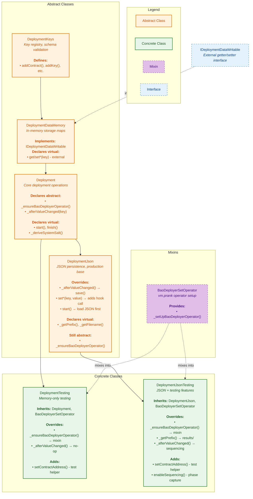
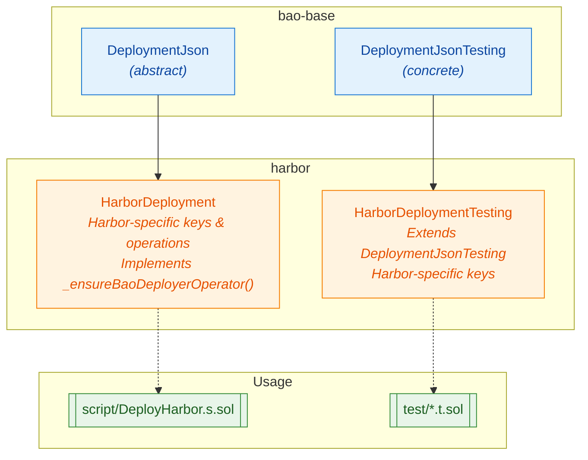

# Deployment Architecture Overview

This document describes the bao-base deployment framework architecture, showing the inheritance hierarchy and how downstream projects (like Harbor) extend it.

## Use Cases

There are three deployment class chains, each for a specific use case:

| Use Case                | Base Class              | Concrete         | Storage   | Public Setters | BaoDeployer                                   |
| ----------------------- | ----------------------- | ---------------- | --------- | -------------- | --------------------------------------------- |
| **Production**          | `DeploymentJson`        | HarborDeployment | JSON file | No             | Fixed hex bytecode, production operator check |
| **Testing with JSON**   | `DeploymentJsonTesting` | (is concrete)    | JSON file | Yes            | Compiled bytecode, vm.prank operator          |
| **Testing memory-only** | `DeploymentTesting`     | (is concrete)    | In-memory | Yes            | Compiled bytecode, vm.prank operator          |

### Production vs Testing: BaoDeployer Differences

**BaoDeployer Bytecode:**

- **Testing:** Uses `type(BaoDeployer).creationCode` - compiled from source during tests
- **Production:** Should use fixed hex bytecode to ensure deploying exactly what was audited

**BaoDeployer Operator:**

- **Testing:** Uses vm.prank to set `address(this)` as operator
- **Production:** Verifies operator is already set (done by multisig transaction)

### Production (`DeploymentJson` - abstract)

- Persists deployment state to JSON files
- No public setters - all configuration comes from loading existing JSON files
- Production deployment flow: load config → deploy → save results
- **Abstract functions downstream must implement:**
  - `_ensureBaoDeployerOperator()` - verify operator is set by multisig
  - Optionally override `DeploymentInfrastructure` to use fixed hex bytecode

### Testing with JSON (`DeploymentJsonTesting` - concrete)

- Persists deployment state to JSON files (in test output directory)
- Public setters for test setup (inherited from `DeploymentDataMemory`)
- Sequencing support for capturing deployment phases
- Uses `BaoDeployerSetOperator` mixin for vm.prank setup

### Testing memory-only (`DeploymentTesting` - concrete)

- Fast, no file I/O
- Public setters for test setup (inherited from `DeploymentDataMemory`)
- Uses `BaoDeployerSetOperator` mixin for vm.prank setup

## Design Principles

1. **Linear core inheritance** - The main chain is strictly linear to avoid diamond inheritance issues
2. **Single override per virtual** - Each virtual function is overridden on exactly one path to any concrete class
3. **Visibility control via inheritance** - `DeploymentJson` makes setters internal; testing variants inherit public setters

## Core Inheritance Hierarchy



## Virtual Function Override Paths

Each virtual function has exactly one override on the path to each concrete class:

### From `Deployment` (abstract functions)

| Function                       | Purpose                        | DeploymentJson     | DeploymentTesting | DeploymentJsonTesting |
| ------------------------------ | ------------------------------ | ------------------ | ----------------- | --------------------- |
| `_ensureBaoDeployerOperator()` | Set up BaoDeployer for CREATE3 | **still abstract** | mixin (vm.prank)  | mixin (vm.prank)      |
| `_afterValueChanged(key)`      | Hook after value write         | save()             | no-op             | sequencing + super    |

### From `Deployment` (virtual functions with default impl)

| Function              | Default            | DeploymentJson              | DeploymentTesting | DeploymentJsonTesting           |
| --------------------- | ------------------ | --------------------------- | ----------------- | ------------------------------- |
| `start()`             | Set session state  | Load JSON first, then super | _inherited_       | _inherited from DeploymentJson_ |
| `finish()`            | Transfer ownership | _inherited_                 | _inherited_       | _inherited_                     |
| `_deriveSystemSalt()` | Return system salt | _inherited_                 | _inherited_       | _inherited_                     |

### From `DeploymentDataMemory` (virtual external, implements interface)

| Function                 | Visibility | DeploymentJson      | DeploymentTesting | DeploymentJsonTesting           |
| ------------------------ | ---------- | ------------------- | ----------------- | ------------------------------- |
| `get(key)`               | external   | _inherited_         | _inherited_       | _inherited_                     |
| `getAddress(key)`        | external   | _inherited_         | _inherited_       | _inherited_                     |
| `setAddress(key, value)` | external   | override: adds hook | _inherited_       | _inherited from DeploymentJson_ |
| _(all other setters)_    | external   | override: adds hook | _inherited_       | _inherited from DeploymentJson_ |

### From `DeploymentJson` (virtual functions)

| Function               | Default     | DeploymentJsonTesting   |
| ---------------------- | ----------- | ----------------------- |
| `_getPrefix()`         | "." (cwd)   | "results" or env var    |
| `_getFilename()`       | `_filename` | Override for sequencing |
| `_afterValueChanged()` | save()      | sequencing + super      |

## No Diamond Inheritance

With this design, there are no diamonds. The mixin is used only for the abstract function implementation:

```
                           BaoDeployerSetOperator (mixin)
                                      │
                     ┌────────────────┼────────────────┐
                     │                │                │
DeploymentKeys → DeploymentDataMemory → Deployment     │
                                            │          │
               ┌────────────────────────────┼──────────┤
               │                            │          │
               ▼                            ▼          │
    DeploymentTesting (concrete)     DeploymentJson    │
                                       (abstract)      │
                                            │          │
                                            ▼          │
                                DeploymentJsonTesting ─┘
                                     (concrete)
```

Each concrete class has exactly one path from `Deployment`, and the mixin provides `_ensureBaoDeployerOperator()` without creating a diamond (it has no shared base with the main chain).

## File Layout

```
script/deployment/
├── DeploymentKeys.sol              # Key registry (abstract)
├── DeploymentDataMemory.sol        # Storage layer (abstract, extends Keys)
├── Deployment.sol                  # Core operations (abstract, extends DataMemory)
├── DeploymentJson.sol              # JSON persistence (abstract, extends Deployment)
├── DeploymentTesting.sol           # Concrete: Memory-only testing
├── DeploymentJsonTesting.sol       # Concrete: JSON + Testing (extends DeploymentJson)
├── BaoDeployerSetOperator.sol      # Mixin: vm.prank operator setup for testing
└── BaoDeployer.sol                 # CREATE3 factory
```

## Downstream Usage (Harbor example)



## Key Design Decisions

1. **Merged data storage into inheritance chain** - No separate data layer instance via `_data` pointer
2. **Abstract production base** - `DeploymentJson` is abstract; downstream projects implement `_ensureBaoDeployerOperator()`
3. **Mixin for testing** - `BaoDeployerSetOperator` provides vm.prank setup without creating diamond inheritance
4. **Visibility control via override** - `DeploymentJson` overrides setters to add persistence hook; testing classes inherit public setters from `DeploymentDataMemory`
5. **No diamonds** - Linear paths from `Deployment` to each class; mixin has no shared base with main chain
