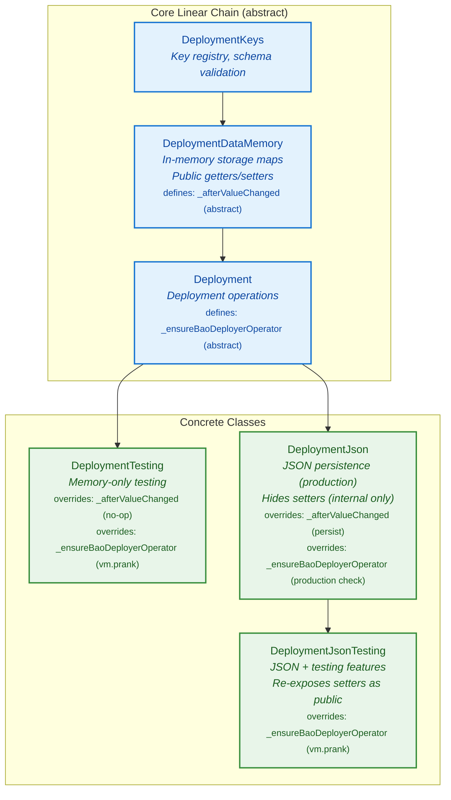
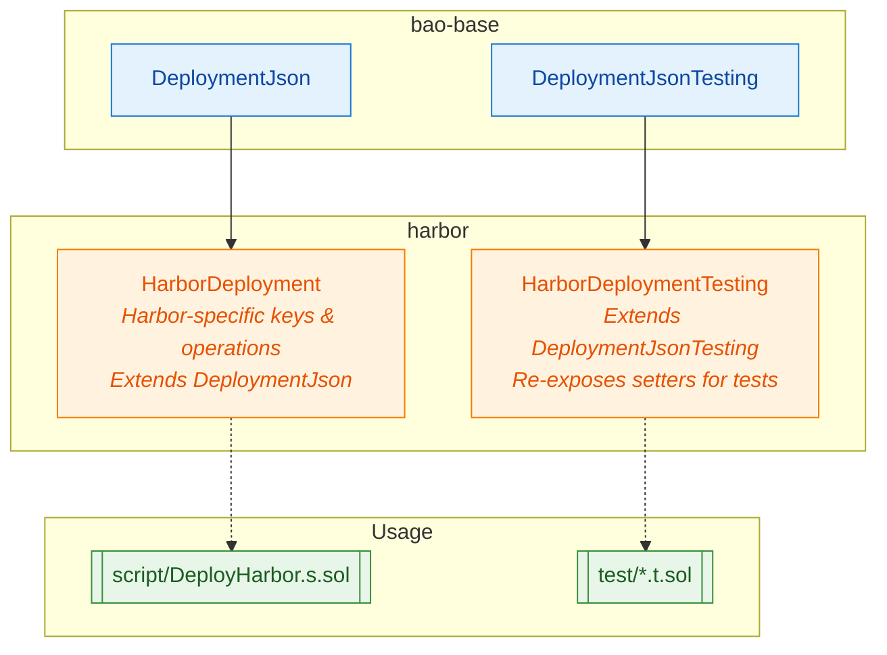

# Deployment Architecture Overview

This document describes the bao-base deployment framework architecture, showing the inheritance hierarchy and how downstream projects (like Harbor) extend it.

## Design Principles

1. **Linear core inheritance** - The main chain is strictly linear to avoid diamond inheritance issues
2. **Single override per virtual** - Each virtual function is overridden on exactly one path to any concrete class
3. **Deployment is the memory-based test class** - No separate "memory testing" class needed
4. **DeploymentJson hides setters for production** - Testing variants re-expose them

## Core Inheritance Hierarchy



## Key Insight: Visibility Control

- `DeploymentDataMemory` has **public** getters/setters (usable in tests)
- `DeploymentJson` makes setters **internal** (production safety)
- `DeploymentJsonTesting` re-exposes setters as **public** (test harnesses need them)

This means:

- `DeploymentTesting` is for memory-only unit tests (fast, no persistence)
- `DeploymentJson` is for production scripts (persists to filesystem)
- `DeploymentJsonTesting` is for integration tests that need persistence + test helpers

## Virtual Function Override Paths

Each virtual is overridden on **exactly one path** to avoid diamond conflicts:

| Virtual Function               | Defined In           | Override Path                       | Purpose               |
| ------------------------------ | -------------------- | ----------------------------------- | --------------------- |
| `_afterValueChanged()`         | DeploymentDataMemory | → DeploymentTesting (no-op)         | Hook after data write |
| `_afterValueChanged()`         | DeploymentDataMemory | → DeploymentJson (persist)          | Hook after data write |
| `_ensureBaoDeployerOperator()` | Deployment           | → DeploymentTesting (vm.prank)      | Setup for tests       |
| `_ensureBaoDeployerOperator()` | Deployment           | → DeploymentJson (production check) | Setup for production  |
| `_ensureBaoDeployerOperator()` | Deployment           | → DeploymentJsonTesting (vm.prank)  | Setup for tests       |

## No Diamond Inheritance

With this design, there are no diamonds:

```
DeploymentKeys → DeploymentDataMemory → Deployment
                                            │
                              ┌─────────────┼─────────────┐
                              │             │             │
                              ▼             ▼             │
                    DeploymentTesting  DeploymentJson     │
                                            │             │
                                            ▼             │
                                  DeploymentJsonTesting ──┘
```

Each concrete class has exactly one path from `Deployment`.

## File Layout

```
script/deployment/
├── DeploymentKeys.sol              # Key registry (abstract)
├── DeploymentDataMemory.sol        # Storage layer (abstract, extends Keys)
├── Deployment.sol                  # Core operations (abstract, extends DataMemory)
├── DeploymentTesting.sol           # Concrete: Memory-only testing
├── DeploymentJson.sol              # Concrete: JSON persistence (production)
├── DeploymentJsonTesting.sol       # Concrete: JSON + Testing
├── BaoDeployerSetOperator.sol      # Helper: VM.prank operator setup
└── BaoDeployer.sol                 # CREATE3 factory
```

## Downstream Usage (Harbor example)



## Key Changes from Previous Architecture

1. **Merged data storage into inheritance chain** - No more separate data layer instance via `_data` pointer
2. **Removed `_createDeploymentData()` factory pattern** - Data storage is inherited, not composed
3. **Removed `DeploymentDataJson`** - JSON serialization moved directly to `DeploymentJson`
4. **Removed `IDeploymentDataWritable` interface** - No longer needed since we use inheritance
5. **No diamonds** - Linear paths from `Deployment` to each concrete class
6. **Visibility control via inheritance** - `DeploymentJson` hides setters; `DeploymentJsonTesting` re-exposes them
7. **Renamed `DeploymentMemoryTesting`** → `DeploymentTesting` (it's the simple memory-based test class)
