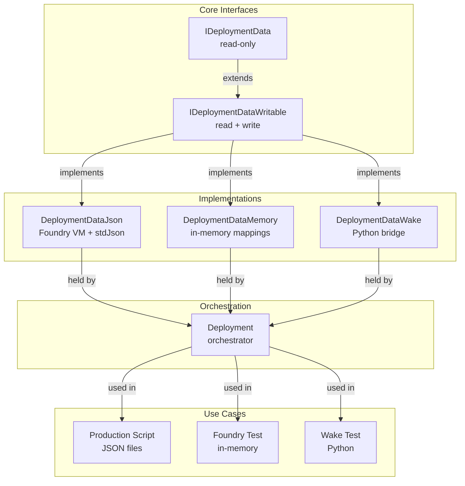
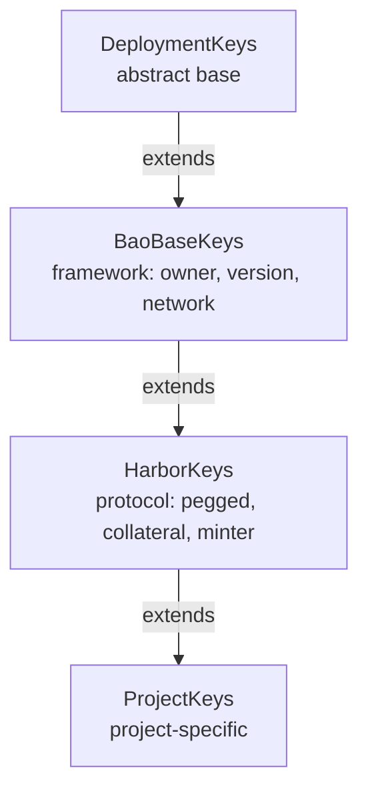
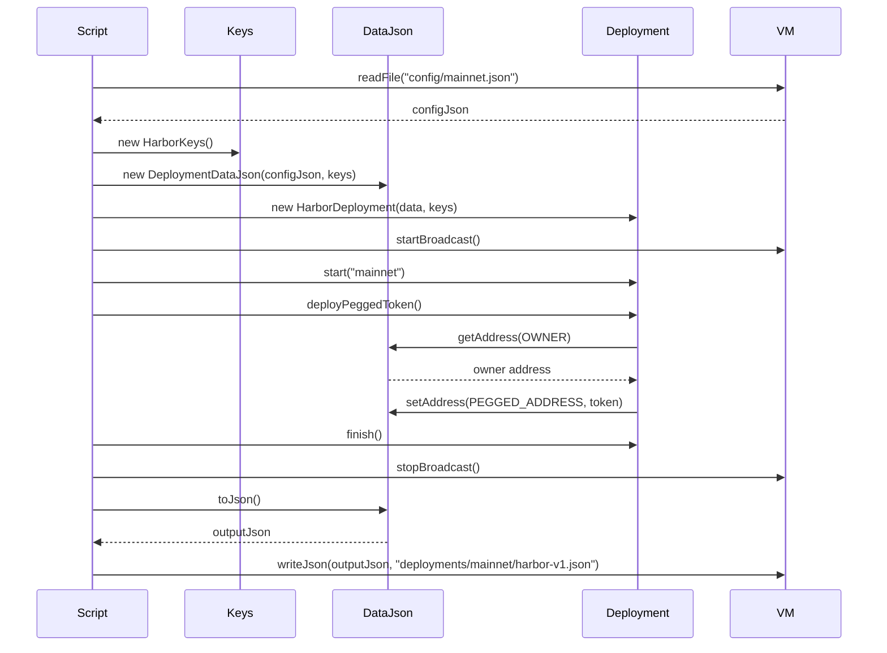
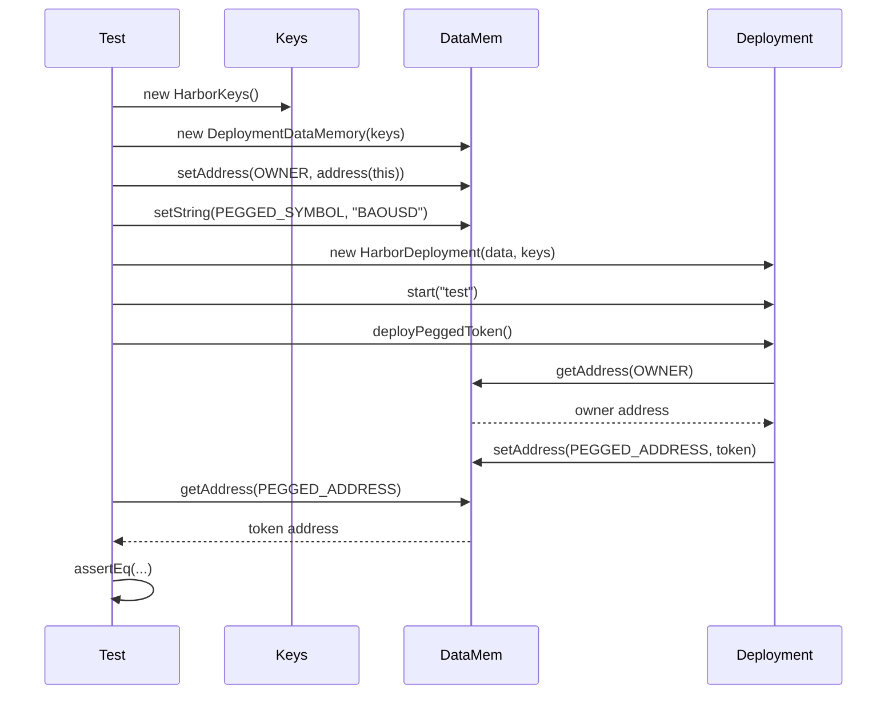
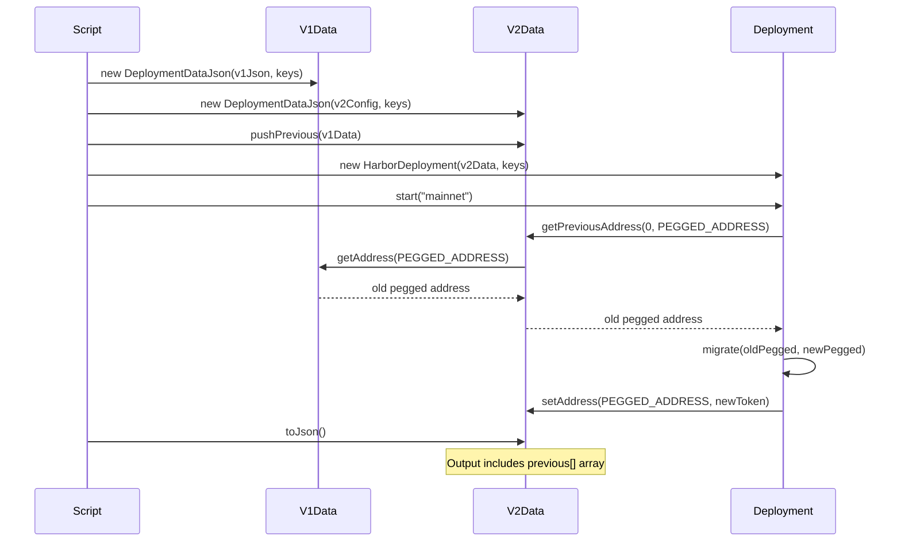
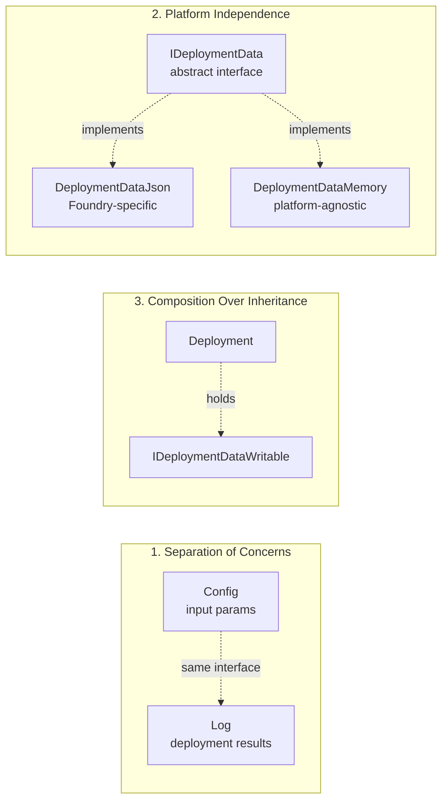

# Deployment Data Architecture

**Status**: Implementation in Progress
**Last Updated**: 25 November 2025

## Executive Summary

The deployment system uses a unified data interface for both configuration and deployment state. Config values are set programmatically (tests) or loaded from JSON (production). Deployment results are written to the same interface. The entire state serializes to JSON matching the existing format.

**Key Properties:**

- Single interface for config input and deployment output
- Platform-agnostic: same Deployment code works with any IDeploymentDataWritable implementation
- Production: DeploymentDataJson (VM.parseJson + serialization)
- Tests: DeploymentDataJson OR DeploymentDataMemory (tester's choice)
- Hierarchical key structure: `"deployment.pegged.symbol"`, `"deployment.minter.bands"`
- Type-safe key validation via DeploymentKeys
- No "start vs resume" distinction - tests just set initial state
- Output format identical to existing `results/deployments/*.json` files

---

## Architecture Overview



**Key Registry Hierarchy:**



---

## Core Interfaces

### IDeploymentData (Read-Only)

Provides read access to deployment configuration and state.

**Scalar getters** (one per type):

```solidity
function getAddress(string memory key) external view returns (address);
```

Also available for: `string`, `uint256`, `int256`, `bool`

**Array getters** (whole arrays only, no element access):

```solidity
function getAddressArray(string memory key) external view returns (address[] memory);
```

Also available for: `string[]`, `uint256[]`, `int256[]`

**Introspection:**

```solidity
function has(string memory key) external view returns (bool);
function getType(string memory key) external view returns (string memory);
function keys() external view returns (string[] memory);
```

### IDeploymentDataWritable (Read + Write)

Extends read interface with write operations and history management.

**Scalar setters** (matching getter types):

```solidity
function setAddress(string memory key, address value) external;
```

Also available for: `string`, `uint256`, `int256`, `bool`

**Array setters** (replace entire array):

```solidity
function setAddressArray(string memory key, address[] memory values) external;
```

Also available for: `string[]`, `uint256[]`, `int256[]`

**Previous deployment history:**

```solidity
function pushPrevious(IDeploymentData previous) external;
function getPreviousAddress(uint256 index, string memory key) external view returns (address);
// Also available: getPreviousString, getPreviousUint, getPreviousInt, getPreviousBool
function previousCount() external view returns (uint256);
```

**Design decisions:**

- Keys use dot notation for hierarchy: `"pegged.symbol"`, `"minter.bands"`
- Keys are bare - no "deployment." prefix
- JSON pointer translation happens in DeploymentDataJson: `"owner"` → `"$.deployment.owner"`
- Memory implementation uses keys as-is: `"owner"` → `mapping["owner"]`
- Arrays are atomic (no `"array[0]"` access)
- Previous deployments in flat array: `previous[0]` = most recent
- No `save()`/`load()` in interface - persistence is external

---

## Key Validation System

### DeploymentKeys (Abstract Contract)

Projects extend this to register configuration keys with type validation.

**Core methods:**

- `addKey(key, type)` - Register a key with expected type
- `validateKey(key, expectedType)` - Runtime validation with helpful error messages
- `getAllKeys()` - List all registered keys

**Key format validation:**

- Allows: `a-z`, `A-Z`, `0-9`, `.` (hierarchy), `_`, `-`
- Dots map to JSON pointers: `"pegged.symbol"` → `$.pegged.symbol`
- No special characters that break JSON pointers

### Layered Key Definitions

Each project layer extends the previous layer's keys:

```solidity
// bao-base framework keys (future)
abstract contract BaoBaseKeys is DeploymentKeys {
  function _registerBaoBaseKeys() internal {
    addAddressKey("owner");
    addStringKey("version");
    addStringKey("network");
    addStringKey("saltString");
  }
}

// Harbor protocol keys extend framework (future)
abstract contract HarborKeys is BaoBaseKeys {
  // Key constants for type-safe access
  string internal constant OWNER = "owner";
  string internal constant VERSION = "version";
  string internal constant NETWORK = "network";
  string internal constant PEGGED_SYMBOL = "pegged.symbol";
  string internal constant PEGGED_NAME = "pegged.name";
  string internal constant MINTER_BANDS = "minter.bands";

  function _registerHarborKeys() internal {
    _registerBaoBaseKeys();
    addStringKey(PEGGED_SYMBOL);
    addStringKey(PEGGED_NAME);
    addUintArrayKey(MINTER_BANDS);
    // ... additional protocol keys
  }
}

// Test-specific keys
contract TestDeploymentKeys is HarborKeys {
  string internal constant TEST_VALUE = "test.value";

  constructor() {
    _registerHarborKeys();
    addUintKey(TEST_VALUE);
  }
}
}

// Project-specific keys extend protocol
contract MyProjectKeys is HarborKeys {
  string internal constant CUSTOM_PARAM = addKey("myproject.param", "bool");
}
```

**Benefits:**

- Compile-time constants (autocomplete, refactoring)
- Runtime validation prevents typos
- Meaningful error messages
- Extensible across project boundaries
- Keys are bare strings ("owner", "pegged.symbol") - no prefix
- JSON pointer translation in DeploymentDataJson only
- Memory implementation uses keys directly

---

## Implementations

### DeploymentDataJson (Production)

Uses Foundry's `stdJson` and VM cheatcodes for JSON operations with automatic file persistence.

**Characteristics:**

- Auto-saves to timestamped files on every write operation
- Reads from JSON pointer paths (e.g., `$.pegged.symbol`)
- Uses `JsonArrays` helper library for array serialization
- Stores previous deployments in `previous[n]` structure
- Sequential deployment tracking with ISO 8601 timestamps

**File Structure:**

```
deployments/
├── config.json                                    # Network-agnostic config (input)
└── {network}/                                     # e.g., mainnet, arbitrum, anvil
    └── {systemSaltString}/                        # e.g., Harbor-v1
        ├── 2025-11-25T14-30-00.json              # First deployment
        ├── 2025-11-25T15-45-30.json              # Second deployment
        └── 2025-11-25T16-12-00.001.json          # Anvil (with collision avoidance)
```

**Constructor:**

```solidity
constructor(
    DeploymentKeys keyRegistry,
    string memory network,        // "mainnet", "arbitrum", "anvil"
    string memory systemSaltString, // "Harbor-v1"
    string memory inputTimestamp  // "", "first", "latest", or ISO timestamp
)
```

**Input Timestamp Options:**

- `""` or `"first"` → Load from `deployments/config.json` (network-agnostic config)
- `"latest"` → Load from newest file in `deployments/{network}/{systemSaltString}/`
- `"2025-11-25T14-30-00"` → Load from specific timestamped deployment

**Timestamp Generation:**

- ISO 8601 format: `YYYY-MM-DDTHH-MM-SS`
- Auto-generated from `block.timestamp`
- Anvil collision handling: Appends `.001`, `.002`, etc. for same-second deployments
- Supports up to 1000 deployments per second (sufficient for test suites)

**File Persistence:**

- Every `set*()` operation triggers auto-save
- Creates directory structure automatically
- Never overwrites existing files (always new timestamp)
- Testing variant (`DeploymentDataJsonTesting`): Uses `results/` directory

**Use cases:**

- Production deployment scripts
- Sequential deployments (deploy → output → load output → deploy again)
- Audit trail with full history
- Resume/incremental deployments from specific state

### DeploymentDataMemory (Testing)

Uses Solidity mappings for fast in-memory storage.

**Characteristics:**

- No JSON overhead
- No filesystem access
- Separate mappings per type: `mapping(string => address)`, `mapping(string => uint256)`, etc.
- Simple `string[]` for key tracking

**Use cases:**

- Foundry tests
- Fast iteration
- Scenarios without persistence needs

### DeploymentDataWake (Future)

Python bridge for Wake testing environment.

**Planned approach:**

- Python dict → Solidity contract bridge
- Wake's Python API translates method calls
- Same interface as other implementations
- Enables Python-based testing workflows

---

## Usage Patterns

### Production Script Flow



Key steps:

1. Load configuration from JSON file
2. Create key registry (HarborKeys)
3. Create JSON-backed data store
4. Create deployment orchestrator with data reference
5. Run deployment (reads from config, writes to log)
6. Save deployment log to file

### Foundry Test Flow



Key differences from production:

- In-memory data store (no file I/O)
- Configuration set programmatically
- No JSON serialization overhead
- Same deployment code as production

### Upgrading from Previous Deployment

When deploying a new version that needs access to previous deployment addresses:



**Result JSON structure:**

```json
{
  "owner": "0x...",
  "version": "2.0.0",
  "pegged": {
    "address": "0xNEW...",
    "symbol": "NEWUSD"
  },
  "previous": [
    {
      "version": "1.0.0",
      "pegged": {
        "address": "0xOLD...",
        "symbol": "BAOUSD"
      }
    }
  ]
}
```

Previous deployments are flattened: `previous[0]` = most recent, `previous[1]` = second-most recent, etc.

---

## Deployer Libraries Pattern

Deployer libraries encapsulate contract deployment logic with clean separation of concerns.

### Builder Helper

The `DeploymentBuilder` library provides `use*()` functions that read from config and record to log in one step:

```solidity
library DeploymentBuilder {
  function useAddress(IDeploymentDataWritable data, string memory key) internal returns (address value) {
    value = data.getAddress(key);
    data.setAddress(key, value); // Record what we used
  }

  function useString(IDeploymentDataWritable data, string memory key) internal returns (string memory value) {
    value = data.getString(key);
    data.setString(key, value);
  }

  // Also: useUint, useInt, useBool, use*Array variants
}
```

### Deployer Library Structure

```solidity
library PeggedTokenDeployer {
  /**
   * @notice Deploy pegged token using config from data
   * @dev Reads parameters, deploys contract, records to log
   *      Address is written to data, not returned (single source of truth)
   */
  function deploy(Deployment deployment, IDeploymentDataWritable data, HarborKeys keys) internal {
    // Read from config, record to log, encode in one expression
    bytes memory initData = abi.encodeCall(
      PeggedToken.initialize,
      (
        builder.useAddress(data, keys.OWNER),
        builder.useString(data, keys.PEGGED_NAME),
        builder.useString(data, keys.PEGGED_SYMBOL),
        uint8(builder.useUint(data, keys.PEGGED_DECIMALS))
      )
    );

    // deployProxy writes address to data (keys.PEGGED_ADDRESS)
    deployment.deployProxy(keys.PEGGED_ADDRESS, "PeggedToken_v1", initData);
  }
}
```

### Usage in Deployment

```solidity
contract HarborDeployment is Deployment {
  HarborKeys internal _keys;

  function deployPeggedToken() public {
    PeggedTokenDeployer.deploy(this, _data, _keys);
    // Address available via: _data.getAddress(_keys.PEGGED_ADDRESS)
  }
}
```

**Design principles:**

- `use*()` builder functions read and record in one step
- No intermediate variables for parameters
- No return values - addresses live in `data` (single source of truth)
- Type-safe `abi.encodeCall` ensures correct parameter types
- Lightweight: one `deploy()` function per contract type
- Reusable across production and tests

---

## Design Principles



### 1. Separation of Concerns

**Configuration** (input) and **Logging** (output) use the same interface but serve different purposes:

- Configuration provides deployment parameters
- Logging records deployment results
- Both serialize to identical JSON format
- Deployment output can become next deployment's input

### 2. Platform Independence

Core abstractions (`IDeploymentData`) have no dependency on:

- Foundry VM cheatcodes
- Filesystem operations
- JSON libraries

Platform-specific implementations handle these concerns in isolation.

### 3. Composition Over Inheritance

`Deployment` **holds** `IDeploymentDataWritable`, doesn't inherit from it:

- Clear separation of orchestration vs storage
- Easy to swap implementations for testing
- Deployment logic independent of persistence mechanism

### 4. Explicit Over Implicit

- Keys registered explicitly via `addKey()`
- Types validated at runtime
- No "magic" overlay resolution
- Clear error messages guide developers

### 5. Test/Production Parity

Same `Deployment` code works in:

- Production scripts (with JSON persistence)
- Foundry tests (with in-memory storage)
- Wake tests (with Python bridge)

Only the data implementation changes, not the deployment logic.

---

## Future Extensions

### Wake Integration (To Be Implemented)

Wake tests will use a Python-backed implementation:

**Python side:**

```python
class DeploymentDataWake:
    def __init__(self, config_dict):
        self._data = config_dict

    def get_address(self, key: str) -> Address:
        return self._data.get(key.replace('.', '_'))

    def set_address(self, key: str, value: Address):
        self._data[key.replace('.', '_')] = value
```

**Test usage:**

```python
def test_harbor_deployment():
    config = {'owner': accounts[0].address, 'pegged_symbol': 'BAOUSD'}
    data = DeploymentDataWake(config)
    deployment = HarborDeployment.deploy(data)

    deployment.start("test")
    pegged = deployment.deployPeggedToken()
    assert data.get_address('pegged.address') == pegged
```

### Overlay/Override Pattern (Future Consideration)

If configuration override scenarios emerge:

```solidity
interface IDeploymentDataLayered {
  function pushLayer() external;
  function popLayer() external;
  // Lookups check top layer first, fall through to base
}
```

Currently deferred - YAGNI until specific use case identified.

---

## Migration Status

**Current Status**: Week 1 Complete + File Persistence Implemented

**Completed:**

- ✅ DeploymentKeys - hierarchical validation with dot notation
- ✅ DataType enum - separate file for all type definitions
- ✅ IDeploymentData, IDeploymentDataWritable - core interfaces
- ✅ DeploymentDataMemory - in-memory implementation with 100% test coverage
- ✅ DeploymentDataJson - JSON-backed implementation with automatic file persistence
  - ✅ Sequential deployment tracking with ISO 8601 timestamps
  - ✅ Network-specific file structure
  - ✅ Anvil collision avoidance (.001, .002, etc.)
  - ✅ Input timestamp options: "first" (config.json), "latest", or specific timestamp
  - ✅ DeploymentDataJsonTesting variant for test suite (results/ directory)
- ✅ JsonArrays - array serialization helper
- ✅ All tests passing (47/47 for DeploymentDataJson)

**Next Steps:** Refactor Deployment.sol to use composition (see Migration Plan below)

**Key Design Decisions Resolved:**

1. **Key Constants Pattern** - Constants + constructor registration ✅
2. **Test vs Production Deployment** - Mixin pattern ✅
3. **File Persistence** - Auto-save on every write, timestamped files ✅
4. **Network Naming** - Human-readable strings ("mainnet", "arbitrum", "anvil") ✅
5. **Sequential Deployments** - Load from previous output, save to new timestamp ✅

See "Design Decisions" section below for detailed rationale.

---

## Design Decisions (Pending Review)

### Decision 1: Key Constants Pattern

**Problem**: How to define reusable key constants that also register keys?

**Desired Pattern** (doesn't work):

```solidity
// ERROR: Cannot call functions in constant initialization
string internal constant OWNER = addKey("owner");
```

**Option A: Use immutable** (doesn't work for strings)

```solidity
// ERROR: Immutable not allowed for reference types (string, array, struct)
string internal immutable OWNER;
constructor() {
    OWNER = addKey("owner");
}
```

**Option B: Constants + Separate Registration** ✅ **RECOMMENDED**

```solidity
abstract contract HarborKeys is BaoBaseKeys {
  // Constants - single source of truth for key strings
  string internal constant OWNER = "owner";
  string internal constant PEGGED = "pegged";
  string internal constant PEGGED_SYMBOL = "pegged.symbol";
  string internal constant PEGGED_NAME = "pegged.name";
  string internal constant MINTER_BANDS = "minter.bands";

  // Registration in constructor
  constructor() {
    addKey(OWNER); // Register CONTRACT key
    addKey(PEGGED); // Register CONTRACT key
    addStringKey(PEGGED_SYMBOL); // Register STRING key
    addStringKey(PEGGED_NAME); // Register STRING key
    addUintArrayKey(MINTER_BANDS); // Register UINT_ARRAY key
  }
}
```

**Pros:**

- ✅ Constants are truly constant (compile-time)
- ✅ No string duplication - literal appears once
- ✅ Type-safe usage via constants
- ✅ Explicit registration - clear what keys exist
- ✅ Works within Solidity constraints

**Cons:**

- ❌ Two-step process (define constant, register in constructor)
- ❌ Could forget to register a constant (but tests would catch this)

**Mitigation for "forgot to register":**

- Key validation at runtime - if you try to use unregistered key, clear error
- Test coverage ensures all keys work

---

### Decision 2: Test vs Production Deployment Pattern

**Problem**: How to separate test-only capabilities from production deployments?

**Option A: Vertical Inheritance** (simple but duplicates code)

```
Deployment (base)
    ↓
HarborDeployment (protocol)
    ↓
MockHarborDeployment (test only)
```

**Option B: Mixin Pattern** ✅ **RECOMMENDED**

```
           Deployment (base)
                ↓
         HarborDeployment (protocol)
            ↙         ↘
   TestDeployment  ProductionDeployment
         ↓              ↓
TestHarborDeployment  ProductionHarborDeployment
```

**Implementation:**

```solidity
// Base - platform agnostic
abstract contract Deployment {
    IDeploymentDataWritable internal _data;

    function deployProxy(...) { ... }
    function _isTestNetwork() internal view virtual returns (bool);
}

// Test mixin - adds test capabilities
abstract contract TestDeployment is Deployment {
    function _isTestNetwork() internal pure override returns (bool) {
        return true; // Always test mode
    }

    // Test-only helpers available to all protocols
    function fastForward(uint256 time) public {
        require(_isTestNetwork(), "Test only");
        vm.warp(block.timestamp + time);
    }

    function setTestData(string memory key, uint256 value) public {
        require(_isTestNetwork(), "Test only");
        _data.setUint(key, value);
    }
}

// Production mixin - restricts behavior
abstract contract ProductionDeployment is Deployment {
    function _isTestNetwork() internal view override returns (bool) {
        string memory network = _data.getString("network");
        return _eq(network, "anvil") || _eq(network, "test");
    }
}

// Protocol layer (agnostic to test vs production)
abstract contract HarborDeployment is Deployment, HarborKeys {
    function start(string memory network) public virtual {
        address owner = _data.getAddress(OWNER);
        // ... protocol init
    }
}

// Concrete implementations - choose mixin at instantiation
contract TestHarborDeployment is HarborDeployment, TestDeployment {
    // Inherits all test helpers from TestDeployment
}

contract ProductionHarborDeployment is HarborDeployment, ProductionDeployment {
    // Production restrictions enforced
}
```

**Usage in tests:**

```solidity
function test_DeployPegged() public {
  TestHarborDeployment deployment = new TestHarborDeployment();
  deployment.fastForward(1 days); // OK - method exists
  deployment.setTestData("test.value", 123); // OK - test helpers available
}
```

**Comparison:**

| Aspect            | Vertical (Mock)                 | Mixin (Multiple Inheritance)     |
| ----------------- | ------------------------------- | -------------------------------- |
| Test helper reuse | Duplicate per protocol          | Shared via TestDeployment        |
| Type safety       | Runtime checks (`if (isTest)`)  | Compile-time (different types)   |
| Existing pattern  | New                             | Matches current mixins           |
| Complexity        | Simple hierarchy                | Diamond inheritance              |
| Production safety | Can accidentally call test code | Test methods don't exist in prod |

**Pros of Mixin Approach:**

- ✅ **Aligns with existing architecture**: Already use mixins extensively
  - `DeploymentFoundryVm` (adds VM cheatcodes)
  - `DeploymentRegistryJson` (adds JSON serialization)
  - `DeploymentFoundryExecution` composes multiple mixins
- ✅ **Reusable test infrastructure**: Write once in `TestDeployment`, use everywhere
- ✅ **Type-safe**: ProductionHarborDeployment doesn't have `fastForward()` - compiler prevents misuse
- ✅ **Clear intent**: `new TestHarborDeployment()` vs `new ProductionHarborDeployment()`
- ✅ **Separation of concerns**: Test vs production behavior isolated

**Cons of Mixin Approach:**

- ❌ **Diamond inheritance**: Multiple paths to Deployment base
  - Mitigation: Solidity handles with C3 linearization
- ❌ **Constructor ordering**: Need explicit super calls
  - Mitigation: Document constructor patterns
- ❌ **More contracts**: Every protocol needs Test and Production variants
  - Mitigation: Naming convention (`Test*`, `Production*`)
- ❌ **No runtime switching**: Once Test, always Test
  - Mitigation: This is a feature - prevents accidents

**Recommendation: Use Mixin Pattern** because:

1. Consistent with existing codebase patterns
2. Better code reuse across protocols
3. Stronger type safety (compile-time vs runtime)
4. Clearer separation of test vs production concerns

---

## Migration Plan: Deployment.sol Composition Refactoring

### Overview

Refactor Deployment to use composition with IDeploymentDataWritable instead of inheriting from DeploymentRegistry. **Minimal changes** to existing Deployment.sol functionality - it continues to handle proxy deployment, ownership transfer, CREATE3 operations, etc. Only the parameter storage mechanism changes from inheritance to composition.

### Current State

```solidity
abstract contract Deployment is DeploymentRegistry {
    // Inherits: _stringParams, _uintParams, getString(), setString(), etc.

    function start(DeploymentConfig.SourceJson memory config, string memory network) {
        address owner = DeploymentConfig.get(config, "", "owner");
        _registerConfigParameters(config); // Walks JSON tree, calls setString/setUint
        // ... existing logic untouched
    }

    function deployProxy(...) { ... } // Remains unchanged
    function registerImplementation(...) { ... } // Remains unchanged
    function _getCreate3Deployer() { ... } // Remains unchanged
    // etc. - 90% of Deployment.sol stays the same
}
```

### Target State

```solidity
abstract contract Deployment {
    IDeploymentDataWritable internal _data;

    // Contract/proxy/library tracking remains in Deployment
    mapping(string => ContractEntry) internal _contracts;
    mapping(string => ProxyEntry) internal _proxies;
    mapping(string => LibraryEntry) internal _libraries;
    // etc. - deployment operations logic unchanged

    function _initializeDataLayer(IDeploymentDataWritable data) internal {
        _data = data;
    }

    function start(string memory network) public virtual {
        // _data already populated by caller before start()
        // Base class doesn't access keys - subclass handles that
        _metadata.network = network;
        // ... existing logic untouched
    }

    // Convenience delegators
    function getString(string memory key) public view returns (string memory) {
        return _data.getString(key);
    }

    function deployProxy(...) { ... } // Remains unchanged
    function registerImplementation(...) { ... } // Remains unchanged
    function _getCreate3Deployer() { ... } // Remains unchanged

    // Network-specific behavior helper
    function _isTestNetwork() internal view returns (bool) {
        string memory network = _data.getString("network");
        return _eq(network, "anvil") || _eq(network, "test");
    }
    // etc. - 90% of Deployment.sol stays the same
}

// Harbor-specific deployment (uses HarborKeys constants)
abstract contract HarborDeployment is Deployment, HarborKeys {
    constructor() {
        _registerHarborKeys(); // Register all protocol keys
    }

    function start(string memory network) public override {
        address owner = _data.getAddress(OWNER); // Using HarborKeys.OWNER constant
        string memory version = _data.getString(VERSION); // Using HarborKeys.VERSION constant
        _metadata.owner = owner;
        _metadata.version = version;
        super.start(network);
    }
}

// Test mock (allows test-only operations)
contract MockHarborDeployment is HarborDeployment {
    function start(string memory network) public override {
        if (!_isTestNetwork()) revert OnlyTestNetwork();
        super.start(network);
    }

    // Test-only helpers
    function setTestValue(uint256 value) public {
        require(_isTestNetwork(), "Only for test networks");
        _data.setUint("test.value", value);
    }
}
```

### Phase 1: Add Composition (Parallel Implementation)

**Goal**: Add data layer alongside existing DeploymentRegistry, no breaking changes yet

**Changes to Deployment.sol** (3 additions):

1. Add fields:

   ```solidity
   IDeploymentDataWritable internal _data;
   DeploymentKeys internal _keys;
   ```

2. Add initialization:

   ```solidity
   function _initializeDataLayer(IDeploymentDataWritable data, DeploymentKeys keys) internal {
     _data = data;
     _keys = keys;
   }
   ```

3. Add delegation methods (alongside existing inherited methods):
   ```solidity
   function _getDataString(string memory key) internal view returns (string memory) {
     return _data.getString(key);
   }
   function _getDataUint(string memory key) internal view returns (uint256) {
     return _data.getUint(key);
   }
   // Repeat for getInt, getBool, getAddress, arrays
   ```

**Changes to test classes** (DeploymentFoundryExecutionTesting):

4. Update constructors to create and pass data layer:
   ```solidity
   constructor() {
     _keys = new TestDeploymentKeys(); // Each test suite defines its keys
     _data = new DeploymentDataMemory(_keys);
     _initializeDataLayer(_data, _keys);
   }
   ```

**Status after Phase 1**:

- Tests still work (using old DeploymentRegistry methods)
- New \_data field exists but not yet used
- Both systems operational in parallel
- Zero test changes

### Phase 2: Update Configuration Loading

**Goal**: Replace DeploymentConfig with direct data layer usage

**Changes to Deployment.sol**:

5. Update `start()` signature (config → no params):

   ```solidity
   // OLD (in Deployment base class)
   function start(DeploymentConfig.SourceJson memory config, string memory network) {
     address owner = DeploymentConfig.get(config, "", "owner");
     string memory version = DeploymentConfig.getString(config, "", "version");
     _registerConfigParameters(config);
     // ... rest of initialization
   }

   // NEW (in Deployment base class - agnostic to keys)
   function start(string memory network) public virtual {
     // _data already populated by caller
     // Base class doesn't know about keys - subclass handles that
     _metadata.network = network;
     _metadata.startTimestamp = block.timestamp;
     // ... rest of initialization unchanged
   }

   // NEW (in HarborDeployment subclass - knows about HarborKeys)
   function start(string memory network) public override {
     address owner = _data.getAddress(OWNER); // Using HarborKeys.OWNER constant
     string memory version = _data.getString(VERSION); // Using HarborKeys.VERSION constant
     _metadata.owner = owner;
     _metadata.version = version;
     super.start(network); // Call base class to complete initialization
   }
   ```

6. Delete `resume()` - unnecessary distinction:

   ```solidity
   // DELETE: resume() methods (both overloads)
   // Tests just set initial state in _data before calling other methods
   ```

7. Delete `_registerConfigParameters()` and helper methods:
   ```solidity
   // DELETE: _registerConfigParameters()
   // DELETE: _registerConfigNode()
   // DELETE: _attemptRegisterLeaf()
   // DELETE: _isArrayNode()
   ```

**Changes to tests** (example: DeploymentBasicTest):

8. Replace JSON string construction with direct set calls:

   ```solidity
   // OLD
   string memory config = '{"owner": "0x123", "version": "1.0", "network": "test"}';
   deployment.start(config, "test-network");

   // NEW (using key constants from HarborKeys)
   TestDeploymentKeys keys = new TestDeploymentKeys();
   DeploymentDataMemory data = new DeploymentDataMemory(keys);

   data.setAddress(keys.OWNER, address(0x123)); // No "deployment." prefix - just "owner"
   data.setString(keys.VERSION, "1.0");
   data.setString(keys.NETWORK, "anvil"); // "anvil" enables test mode

   MockHarborDeployment deployment = new MockHarborDeployment();
   deployment._initializeDataLayer(data);
   deployment.start("anvil"); // Network passed to start() for metadata
   ```

9. For tests needing JSON output, optionally use DeploymentDataJson:

   ```solidity
   // Tests can choose: Memory (fast) or Json (file output)

   // Option A: Fast in-memory
   _data = new DeploymentDataMemory(_keys);

   // Option B: With JSON output
   DeploymentDataJson _dataJson = new DeploymentDataJson(_keys);
   _data = _dataJson; // Assign to interface
   // ... run deployment ...
  string memory outputJson = _dataJson.toJson();
  vm.writeJson(outputJson, "results/deployments/test.json");
   ```

**Status after Phase 2**:

- No more DeploymentConfig usage in Deployment.sol
- Tests set config directly via \_data.set\*()
- start() simplified (no config parameter, just network)
- JSON output still works (via DeploymentDataJson.toJson())
- resume() deleted (tests just set state before calling methods)

### Phase 3: Update All Parameter Access

**Goal**: Replace all DeploymentRegistry parameter methods with \_data delegation

**Pattern** (systematic find/replace):

10. Update parameter reads throughout base Deployment.sol:

    ```solidity
    // OLD (inherited from DeploymentRegistry)
    string memory version = getString("version");
    uint256 value = getUint("someKey");
    address owner = get("owner"); // Special case for CONTRACT type

    // NEW in base Deployment.sol (delegated to _data via wrappers)
    string memory version = getString("version"); // Calls _data.getString("version")
    uint256 value = getUint("someKey"); // Calls _data.getUint("someKey")
    address owner = getAddress("owner"); // Calls _data.getAddress("owner")

    // In subclasses (HarborDeployment), prefer using constants:
    address owner = _data.getAddress(OWNER); // HarborKeys.OWNER = "owner"
    string memory symbol = _data.getString(PEGGED_SYMBOL); // HarborKeys.PEGGED_SYMBOL = "pegged.symbol"
    ```

11. Add convenience wrappers if desired:

    ```solidity
    function getOwner() public view returns (address) {
      return _data.getAddress("deployment.owner");
    }

    function getVersion() public view returns (string memory) {
      return _data.getString("deployment.version");
    }
    ```

**Files to update** (grep-driven):

- `script/deployment/Deployment.sol` - all get*/set* calls
- Any deployer libraries (none currently in bao-base)
- All test files that call deployment.getString(), etc.

**Systematic approach**:

```bash
# Find all parameter access
grep -r "getString\|getUint\|getInt\|getBool" script/deployment/Deployment.sol
# For each: add "deployment." prefix, change to _data delegation
```

**Status after Phase 3**:

- All parameter access goes through \_data
- DeploymentRegistry parameter methods unused
- Ready for cleanup
- All tests still passing

### Phase 4: Remove DeploymentRegistry Inheritance

**Goal**: Delete inherited parameter storage, keep contract tracking in Deployment

**Changes to Deployment.sol**:

12. Stop inheriting DeploymentRegistry:

    ```solidity
    // OLD
    abstract contract Deployment is DeploymentRegistry { ... }

    // NEW
    abstract contract Deployment {
        // Inline the contract tracking fields (not parameter fields)
        DeploymentMetadata internal _metadata;
        RunRecord[] internal _runs;
        mapping(string => ContractEntry) internal _contracts;
        mapping(string => ProxyEntry) internal _proxies;
        mapping(string => LibraryEntry) internal _libraries;
        mapping(string => bool) internal _exists; // for contract keys only
        string[] internal _keys; // contract keys only
        uint256 internal _schemaVersion;

        // Contract tracking methods stay (get(), set(), registerContract, etc.)
        // Parameter methods removed (now delegated to _data)
    }
    ```

**Changes to DeploymentRegistry.sol** (if keeping for other uses):

13. Remove parameter storage:

    ```solidity
    // KEEP (contract tracking - used by Deployment)
    struct ContractEntry { ... }
    struct ProxyEntry { ... }
    event ContractDeployed(...);
    // etc.

    // DELETE (parameter storage - replaced by IDeploymentDataWritable)
    mapping(string => string) internal _stringParams;
    mapping(string => uint256) internal _uintParams;
    mapping(string => int256) internal _intParams;
    mapping(string => bool) internal _boolParams;
    mapping(string => bool) internal _numberSupportsUint;
    mapping(string => bool) internal _numberSupportsInt;

    function getString(string memory key) ... // DELETE
    function setString(string memory key, string memory value) ... // DELETE
    function getUint(string memory key) ... // DELETE
    function setUint(string memory key, uint256 value) ... // DELETE
    function getInt(string memory key) ... // DELETE
    function setInt(string memory key, int256 value) ... // DELETE
    function getBool(string memory key) ... // DELETE
    function setBool(string memory key, bool value) ... // DELETE
    function _setNumberParameter(...) ... // DELETE
    ```

**Alternative: Delete DeploymentRegistry entirely**:

- If contract tracking can live directly in Deployment.sol
- Simpler - one less file
- Decision point: is DeploymentRegistry used elsewhere?

**Status after Phase 4**:

- Clean separation: Deployment composes IDeploymentDataWritable
- No inherited parameter storage
- Contract tracking remains in Deployment (core responsibility)
- Deployment.sol ~10-20 lines shorter

### Phase 5: Update JSON Serialization

**Goal**: Ensure output matches existing format exactly

**Current JSON structure** (from `results/deployments/*.json`):

```json
{
  "deployer": "0x2e234DAe75C793f67A35089C9d99245E1C58470b",
  "deployment": {
    "owner": "0x7FA9385bE102ac3EAc297483Dd6233D62b3e1496",
    "version": "v1.0.0",
    "pegged": {
      "address": "0x3C8Ca53ee5661D29d3d3C0732689a4b86947EAF0",
      "symbol": "BAOUSD"
    },
    "minter": {
      "address": "0xEA0ed18d0e69d007a5d80275c24e95084C8e6Aa0",
      "implementation": "minter__MockMinter",
      "proxyType": "UUPS",
      "salt": "0xabdc...",
      "saltString": "minter"
    }
  },
  "network": "test-network",
  "saltString": "integration-test-salt",
  "schemaVersion": 1,
  "runs": [...]
}
```

**Key observation**:

- Top level: metadata (deployer, network, saltString, schemaVersion, runs)
- `deployment` object: all config + deployed contract addresses
- Contract entries (pegged, minter) include both config (symbol) and results (address)

**Implementation**:

15. DeploymentDataJson JSON pointer translation:

    ```solidity
    // Keys are bare - no prefix in application code
    _data.setAddress("owner", addr);
    _data.setString("pegged.symbol", "BAOUSD");

    // DeploymentDataJson internally translates to JSON pointers for VM.parseJson:
    // "owner" → "$.deployment.owner"
    // "pegged.symbol" → "$.deployment.pegged.symbol"

    // DeploymentDataMemory uses keys as-is (no translation):
    // "owner" → _addressValues["owner"]
    // "pegged.symbol" → _stringValues["pegged.symbol"]
    ```

16. Update DeploymentRegistryJson (or new mixing) to compose data layer:

    ```solidity
    function toJson() public view returns (string memory) {
      string memory json = "root";

      // Top-level metadata
      json = vm.serializeAddress(json, "deployer", _metadata.deployer);
      json = vm.serializeString(json, "network", _metadata.network);
      json = vm.serializeString(json, "saltString", _metadata.systemSaltString);
      json = vm.serializeUint(json, "schemaVersion", _schemaVersion);

      // Embed data layer (produces "deployment": {...} object)
      string memory deploymentData = _data.toJson();
      json = vm.serializeString(json, "deployment", deploymentData);

      // Runs array
      string memory runsJson = _serializeRuns();
      return vm.serializeString(json, "runs", runsJson);
    }
    ```

17. DeploymentDataJson.toJson() implementation:

    ```solidity
    function toJson() external view returns (string memory) {
      // Returns object with bare keys structured hierarchically
      // "owner" → {"owner": "0x..."}
      // "pegged.symbol" → {"pegged": {"symbol": "BAOUSD"}}
      // Dot notation creates nested objects in JSON output
    }

    // Helper for JSON pointer translation (internal use only)
    function _toJsonPointer(string memory key) internal pure returns (string memory) {
      return string.concat("$.deployment.", key);
    }
    ```

**Status after Phase 5**:

- JSON output byte-for-byte identical to existing format
- `deployment.*` keys map correctly to JSON structure
- Top-level fields (deployer, network, runs) in Deployment
- Contract/config data in \_data layer

### Phase 6: Delete Obsolete Code

**Goal**: Remove unused abstraction layers

18. DELETE files:

    ```
    script/deployment/DeploymentConfig.sol
    script/deployment/DeploymentRegistry.sol (if not needed elsewhere)
    test/deployment/DeploymentConfigTest.t.sol (obsolete tests)
    test/deployment/DeploymentConfigParameterBag.t.sol (obsolete tests)
    ```

19. UPDATE remaining tests:

    - Remove DeploymentConfig imports
    - Remove JSON config string construction
    - Use direct \_data.set\*() calls
    - Verify coverage maintained

20. Final verification:

    ```bash
    # No DeploymentConfig references remain
    grep -r "DeploymentConfig" script/ test/

    # All tests pass
    forge test

    # Coverage maintained
    forge coverage
    ```

**Status after Phase 6**:

- Clean architecture: Deployment composes IDeploymentDataWritable
- No DeploymentConfig, no inherited parameter storage
- Same functionality, clearer separation
- ~300-500 lines of code deleted

### Implementation Timeline

**Week 2: Integration (Phase 1-2)**

- Day 1-2: Add \_data/\_keys fields to Deployment (Phase 1)
- Day 3-4: Update one simple test to use new pattern (Phase 2)
- Day 5: Verify JSON output matches existing format byte-for-byte

**Week 3: Migration (Phase 3)**

- Day 1-3: Update all Deployment.sol parameter access (systematic grep/replace)
- Day 4-5: Update all test files to use \_data.set\*()
- Continuous: Run tests after each file update

**Week 4: Cleanup (Phase 4-6)**

- Day 1-2: Remove DeploymentRegistry inheritance (Phase 4)
- Day 3: Update JSON serialization if needed (Phase 5)
- Day 4: Delete obsolete files (Phase 6)
- Day 5: Final verification, documentation updates

### Key Design Decisions

1. **Platform Agnostic**:

   - Deployment holds `IDeploymentDataWritable` interface, not concrete type
   - Tests choose: `DeploymentDataMemory` (fast) or `DeploymentDataJson` (file output)
   - Same Deployment code works everywhere

2. **Keys Passed In**:

   - Each test/script provides `DeploymentKeys` instance
   - Framework keys (owner, version) in BaoBaseKeys (future)
   - Protocol keys (pegged, minter) in HarborKeys (future)
   - Test-specific keys in test contract

3. **No start/resume distinction**:

   - `start()` removed config parameter
   - Tests set initial state via `_data.set*()`
   - Production loads JSON via `DeploymentDataJson.fromJson()`
   - `start()` only initializes metadata (deployer, network, timestamp)
   - `resume()` deleted - just load data and call methods

4. **Keys are bare, JSON pointer adds prefix**:

   - Keys in code: `"owner"`, `"pegged.symbol"` (no prefix)
   - DeploymentDataJson translates: `"owner"` → `"$.deployment.owner"`
   - DeploymentDataMemory uses keys as-is: `"owner"` → `mapping["owner"]`
   - JSON output structure matches existing format exactly
   - Key constants defined in DeploymentKeys subclass (HarborKeys, etc.)

5. **Minimal Deployment.sol changes**:

   - Contract tracking logic untouched (~600 lines)
   - Proxy deployment logic untouched (~100 lines)
   - CREATE3 factory logic untouched (~50 lines)
   - Ownership transfer logic untouched (~80 lines)
   - Only parameter get/set changes (~50 lines affected)
   - **~90% of Deployment.sol unchanged**

6. **No backward compatibility shims**:

   - Update all call sites directly
   - Break Harbor/other projects (will update after)
   - Clean cut, no technical debt
   - Simpler migration, clearer result

7. **Network-based behavior**:
   - Test networks: `"anvil"`, `"test"` enable test-only operations
   - Production networks: `"mainnet"`, `"arbitrum"` restrict behavior
   - Check via `_isTestNetwork()` helper in Deployment base
   - Mock deployments can enforce test network requirement
   - Allows test-specific helpers (fast-forward time, manipulate state, etc.)

### Migration Risks & Mitigations

| Risk                           | Likelihood | Impact | Mitigation                                                      |
| ------------------------------ | ---------- | ------ | --------------------------------------------------------------- |
| JSON output format mismatch    | Medium     | High   | Compare byte-for-byte with existing files before mass migration |
| Missing DeploymentConfig usage | Low        | Medium | Grep for "DeploymentConfig\\." before declaring done            |
| Key registration errors        | Medium     | Low    | DeploymentKeys validates at registration, clear errors          |
| Performance regression         | Low        | Low    | Tests can use DeploymentDataMemory, benchmark if needed         |
| Test failures during migration | High       | Low    | Update one test at a time, verify before next                   |
| Breaking Harbor deployment     | Certain    | Medium | Expected - coordinate Harbor update after bao-base stable       |

### Success Criteria

✅ All existing tests pass with new data layer
✅ JSON output matches existing format byte-for-byte
✅ Coverage maintained or improved (currently ~82%)
✅ DeploymentConfig.sol deleted
✅ DeploymentRegistry parameter storage deleted
✅ Harbor can be updated to use new pattern (proof of extensibility)
✅ Documentation updated to reflect new architecture

---

## References

- **Current System**: `deployment-system.md` for existing implementation
- **Infrastructure**: `cross-chain-deterministic-deployment.md` for BaoDeployer and CREATE3
- **Harbor Example**: Future `harbor/doc/deployment-architecture.md` for layered project usage
